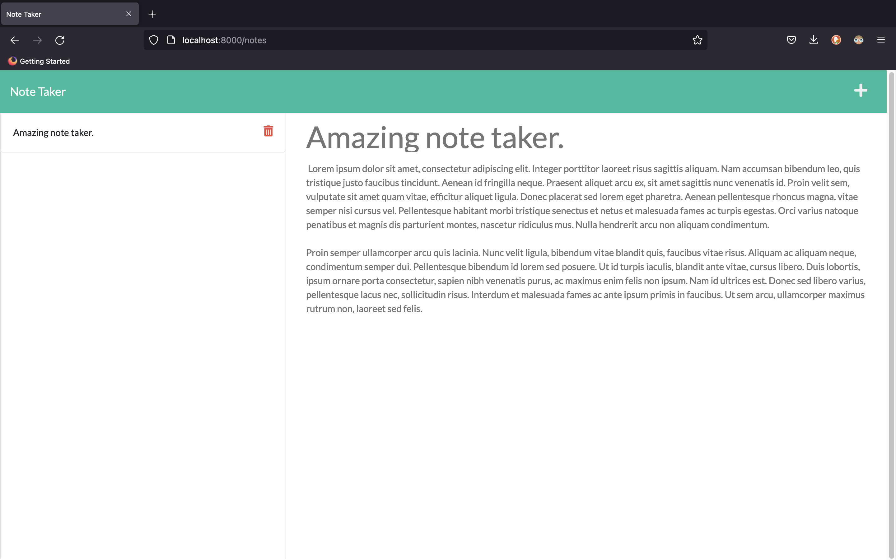

# note-taker-webapp

A professional web application for taking notes.

## Description

This is a web app for taking notes wherever you are and whenever you want.



## Table of contents

* [Usage](#Usage)
* [Installation](#Installation)
* [Demonstration](#Demonstration)

## Usage

Think of a title for your note, it can be your next task, something you want to remind later, maybe 
a gift for someone special!

## Installation

You can clone the project from the [repository](https://github.com/JanInquisitor/note-taker-webapp).
```bash
    git clone https://github.com/JanInquisitor/note-taker-webapp
```

Once you have the project on your machine you can run it with node.
```bash
    node server.js
```

## Contributing

Anyone is welcome to contribute to this project.


## Author

* [JanInquisitor](https://github.com/JanInquisitor)

## License

See the [LICENSE](https://github.com/JanInquisitor) file for information.